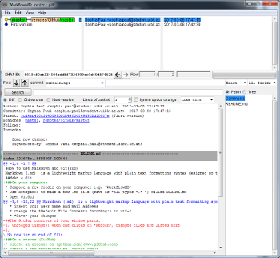

#How to use Markdown and Git(Hub)
> **Markdown (.md)** is a lightweight markup language with plain text formatting syntax designed so that it can be converted to HTML and many other formats using a tool by the same name.

([Wikipedia](https://en.wikipedia.org/wiki/Markdown))

> **GitHub** is a web-based Git or version control repository and Internet hosting service. It offers all of the distributed version control and source code management (SCM) functionality of Git as well as adding its own features.

([Wikipedia](https://en.wikipedia.org/wiki/GitHub))

##Make a new Git

###On your computer
* Compose a new folder on your computer e.g. *WorkflowMD*
* Use Notepad++ to make a new .md file (save as *All types *.* *) called README.md
* Open GitGui
* Choose "Create New Repository" and select the new folder *WorkflowMD*. Click *create*
* Go to Edit > *Options...*
  * insert your user name and mail address
  * change the *Default File Contents Encoding:* to utf-8
  * *Save* your changes
  
###On a server (GitHub)
* create an account on [github.com](www.github.com)
* create a new repository eg. *WorkflowMD*

###Connect server and computer
* In the GitGui go to Remote > Add Remote
* Enter the name and URL of your GitHub repository
* Click *Add*

##The GitGui workflow happens in five steps:
Every step is performed by pushing the respective button in GitGui.

1. **Rescan**: changed files are listed in *Unstaged Changes*. They can be previewed in the yellow window.

![Screenshot Rescan] (Screenshot2.png)

1. **Stage Changed**: chose files to be committed. Those will be listed in *Staged Changes (Will Commit)*
1. **Sign Off**: add message to comment changes
1. **Commit**: commit changes (=add them to the git timeline)
1. **Push**: synchronize files with server you connected earlier
Be happy about the **Success** message. :)

##How to handle versions
* When a change was made, do the GitGui workflow
* After the changes were committed, they can be viewed as version in GitGui
  * Go to Repository > Visualize master's history
  * All versions can be compared and the master is shown in green
  
* In GitHub, commits can be viewed in the repository (Code > *Commits*)
* Versions can be compared and restored
* Only changes between versions are saved, not the complete file
